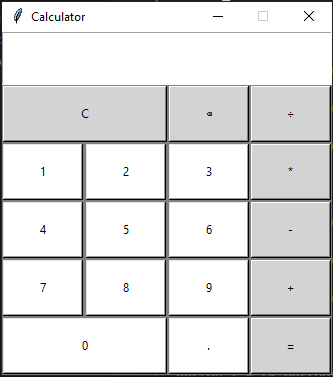

# Calculator GUI

This is a simple calculator gui created using python and tkinter module. I refered to this article for this project https://www.studytonight.com/tkinter/calculator-application-using-tkinter  

